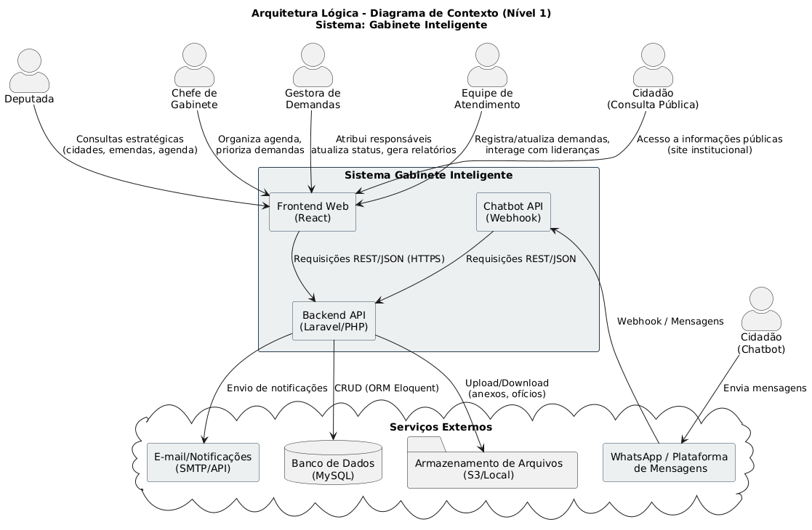
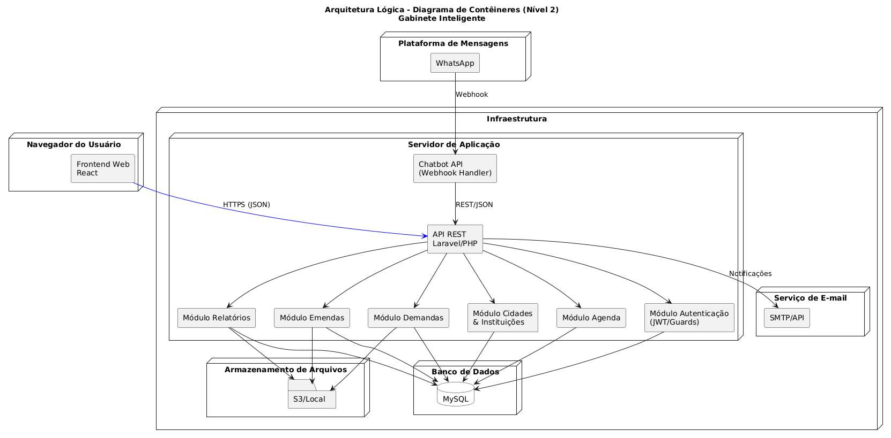
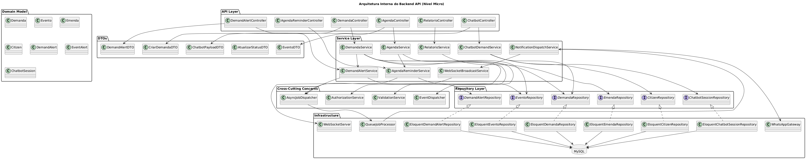

[](https://classroom.github.com/open-in-codespaces?assignment_repo_id=20840370)

# Gabinete Virtual

Sistema web para apoio operacional de gabinete parlamentar, com foco na centralização de demandas, cadastros territoriais, emendas, projetos de lei, agenda, CMS institucional e atendimento automatizado ao cidadão por meio de *chatbot* integrado ao WhatsApp.

O projeto foi construído como uma solução integrada entre:

- `frontend` web em React + Vite
- `backend` em Laravel
- serviço de *chatbot* em FastAPI
- banco PostgreSQL
- notificações assíncronas e alertas em tempo real via *WebSocket*

## Sumário

- [Visão Geral](#visão-geral)
- [Principais Funcionalidades](#principais-funcionalidades)
- [Arquitetura da Solução](#arquitetura-da-solução)
- [Capturas e Artefatos](#capturas-e-artefatos)
- [Estrutura do Repositório](#estrutura-do-repositório)
- [Tecnologias Utilizadas](#tecnologias-utilizadas)
- [Variáveis de Ambiente](#variáveis-de-ambiente)
- [Execução Local](#execução-local)
- [Fluxo Integrado entre Frontend, Backend e Chatbot](#fluxo-integrado-entre-frontend-backend-e-chatbot)
- [Exemplos de Uso](#exemplos-de-uso)
- [Testes](#testes)
- [Deploy](#deploy)
- [Troubleshooting](#troubleshooting)
- [Documentação e Materiais](#documentação-e-materiais)
- [Equipe](#equipe)

## Visão Geral

O **Gabinete Virtual** organiza o fluxo de trabalho de um gabinete parlamentar em um único ambiente. A aplicação substitui controles dispersos em planilhas, mensagens e registros informais por módulos especializados que permitem:

- registrar e acompanhar demandas abertas por cidadãos ou pela equipe
- controlar instituições, lideranças e cidades vinculadas ao gabinete
- acompanhar emendas parlamentares e projetos de lei
- manter agenda institucional com lembretes automáticos
- publicar conteúdo no site institucional
- receber demandas pelo WhatsApp com validações automáticas antes do envio ao `backend`
- notificar equipe interna e cidadãos sobre atualizações relevantes

## Principais Funcionalidades

### Demandas

- abertura manual pelo painel e abertura automatizada via *chatbot*
- classificação por status, prioridade, responsável, cidade e instituição
- vínculo opcional com cidadão identificado por telefone
- anexação de ofício e demais arquivos de apoio
- histórico de alterações
- descarte controlado de demandas inválidas
- notificações para gestor, responsável e cidadão vinculado

### Validação automatizada no chatbot

- detecção de idioma
- detecção de discurso de ódio
- análise de conteúdo ofensivo e tom agressivo
- detecção de *spam*
- verificação de similaridade com demandas já abertas na mesma cidade

### Cadastros territoriais e relacionamento

- cidades
- instituições
- lideranças
- cidadãos e telefones vinculados

### Emendas e projetos de lei

- criação e edição com status padronizados
- filtros e listagens para acompanhamento
- consolidação para consulta estratégica no `dashboard`

### Agenda e lembretes

- cadastro e edição de eventos
- filtros por intervalo de datas
- lembretes automáticos para usuários
- alertas previstos para 10 dias, 1 dia e 1 hora antes do evento

### CMS institucional

- notícias com upload de imagem
- páginas institucionais
- projetos exibidos no site público
- entrega de mídia por rota pública do `backend`

### Notificações em tempo real

- envio de alertas para o painel web via *WebSocket*
- envio de mensagens ao cidadão por WhatsApp quando permitido
- processamento assíncrono por `jobs` e fila do Laravel

## Arquitetura da Solução

### Visão macro

O projeto adota separação clara de responsabilidades:

- o `frontend` concentra interface, roteamento, filtros, formulários e consumo da API
- o `backend` centraliza regras de negócio, autorização, persistência, arquivos, filas e integração entre módulos
- o *chatbot* atua como canal de entrada e saída de mensagens, sem acessar diretamente o banco de dados
- o banco de dados persiste entidades do domínio e tabelas de suporte a alertas, notificações e histórico

Essa divisão reduz acoplamento, facilita testes e permite evoluir o canal conversacional sem duplicar regras de negócio do sistema principal.

### Diagramas principais

#### Contexto



#### Contêineres



#### Arquitetura do backend



#### Componentes e implantação

- [Diagrama de componentes](Artefatos/Componentes%20e%20Implantacao/Diagrama-componentes.png)
- [Diagrama de implantação](Artefatos/Componentes%20e%20Implantacao/Diagrama-implantacao.png)

### Integração interna

1. O `frontend` consome a API REST do `backend`.
2. O `backend` persiste dados, agenda `jobs`, emite alertas e consulta serviços auxiliares.
3. O *chatbot* recebe *webhooks* do WhatsApp, conversa com o cidadão e chama o `backend` para buscar ou registrar informações.
4. Quando há atualização relevante, o `backend` cria alertas e aciona o *chatbot* tanto para envio de mensagem quanto para publicação de alerta em tempo real.
5. O `frontend` mantém conexão *WebSocket* com o serviço do *chatbot* para exibir alertas globais em qualquer tela do sistema.

## Artefatos

### Artefatos úteis

- [Diagrama de casos de uso geral](Artefatos/Casos%20de%20Uso/Caso%20de%20Uso.png)
- [Diagrama de classes](Artefatos/Classe/Diagrama%20de%20Classe.png)
- [DER](Artefatos/DER/DER.png)
- [Apresentação final](Divulgacao/Apresentacao/Apresentação%20final%20TCC%20II.pdf)

## Estrutura do Repositório

```text
.
├── Codigo
│   ├── backend-gabinete-virtual
│   │   ├── app
│   │   │   ├── Http
│   │   │   ├── Jobs
│   │   │   ├── Models
│   │   │   ├── Services
│   │   │   └── Support
│   │   ├── database
│   │   ├── routes
│   │   └── docker-compose.yml
│   ├── chatbot-gabinete-virtual
│   │   ├── app
│   │   │   ├── api
│   │   │   ├── models
│   │   │   └── services
│   │   └── tests
│   └── frontend-gabinete-virtual
│       ├── src
│       │   ├── components
│       │   │   ├── app
│       │   │   ├── core
│       │   │   ├── dashboard
│       │   │   └── domains
│       │   ├── layouts
│       │   ├── pages
│       │   ├── routes
│       │   └── types
├── Artefatos
├── Divulgacao
└── Documentacao
```

### Organização por módulo

- `backend-gabinete-virtual/app/Services`: regras de negócio por domínio
- `backend-gabinete-virtual/app/Jobs`: processamento assíncrono de alertas e notificações
- `frontend-gabinete-virtual/src/components/core`: componentes reutilizáveis de UI
- `frontend-gabinete-virtual/src/components/domains`: componentes por domínio de negócio
- `chatbot-gabinete-virtual/app/services/demand_validation`: validações automáticas aplicadas antes do envio da demanda

## Tecnologias Utilizadas

### Backend

- PHP 8.2
- Laravel 12
- MySql
- filas com `QUEUE_CONNECTION=database`
- armazenamento local de arquivos com rota pública `/api/media/{path}`

### Frontend

- React 19
- Vite 7
- TypeScript 5
- Tailwind CSS 4

### Chatbot

- Python 3.11+
- FastAPI
- `httpx`
- `lingua-language-detector`
- `pysentimiento`
- `sentence-transformers`
- `scikit-learn`

### Integrações

- WhatsApp Cloud API
- *WebSocket* para alertas em tempo real
- Docker para ambiente local do `backend`

## Variáveis de Ambiente

### Backend

Arquivo base recomendado: `Codigo/backend-gabinete-virtual/.env.docker.example`

| Variável | Obrigatória | Descrição |
| --- | --- | --- |
| `APP_NAME` | Sim | Nome da aplicação |
| `APP_ENV` | Sim | Ambiente Laravel |
| `APP_KEY` | Sim | Chave da aplicação |
| `APP_DEBUG` | Sim | Modo de depuração |
| `APP_URL` | Sim | URL base da API |
| `APP_PORT` | Sim | Porta exposta pelo contêiner da aplicação |
| `DB_CONNECTION` | Sim | Driver do banco |
| `DB_HOST` | Sim | Host do banco |
| `DB_PORT` | Sim | Porta do banco |
| `DB_DATABASE` | Sim | Nome do banco |
| `DB_USERNAME` | Sim | Usuário do banco |
| `DB_PASSWORD` | Sim | Senha do banco |
| `FORWARD_DB_PORT` | Não | Porta local para acessar o PostgreSQL |
| `FILESYSTEM_DISK` | Sim | Disco de armazenamento dos anexos |
| `QUEUE_CONNECTION` | Sim | Driver da fila |
| `CHATBOT_SERVICE_URL` | Sim | URL base do serviço do *chatbot* |
| `CHATBOT_INTERNAL_TOKEN` | Sim | Token interno para integração segura com o *chatbot* |
| `CHATBOT_SERVICE_TOKEN` | Não | Token alternativo para chamadas ao *chatbot* |
| `WWWUSER` | Não | UID utilizado no `Dockerfile` |
| `WWWGROUP` | Não | GID utilizado no `Dockerfile` |

### Frontend

Crie `Codigo/frontend-gabinete-virtual/.env` quando necessário.

| Variável | Obrigatória | Descrição |
| --- | --- | --- |
| `VITE_API_URL` | Sim | URL base da API REST. Ex.: `http://localhost:8000/api` |
| `VITE_CHATBOT_URL` | Sim | URL base do serviço do *chatbot*. Ex.: `http://localhost:8001` |
| `VITE_USE_POLLING` | Não | Força modo de *polling* para o Vite em ambientes com limite de *watchers* |

### Chatbot

Arquivo lido por padrão: `Codigo/chatbot-gabinete-virtual/.env`

| Variável | Obrigatória | Descrição |
| --- | --- | --- |
| `APP_NAME` | Não | Nome do serviço |
| `APP_ENV` | Sim | Ambiente do FastAPI |
| `APP_HOST` | Não | Host de escuta do servidor |
| `APP_PORT` | Sim | Porta do serviço |
| `APP_LOG_LEVEL` | Não | Nível de log |
| `BACKEND_API_URL` | Sim | URL base do `backend` |
| `BACKEND_API_TOKEN` | Sim | Token usado nas chamadas autenticadas ao `backend` |
| `INTERNAL_API_TOKEN` | Sim | Token interno para receber chamadas do `backend` |
| `WHATSAPP_VERIFY_TOKEN` | Sim | Token de verificação do *webhook* da Meta |
| `WHATSAPP_ACCESS_TOKEN` | Sim | Token de acesso da WhatsApp Cloud API |
| `WHATSAPP_PHONE_NUMBER_ID` | Sim | `Phone Number ID` da conta |
| `WHATSAPP_BUSINESS_ACCOUNT_ID` | Sim | `WhatsApp Business Account ID` |
| `WHATSAPP_APP_SECRET` | Sim | Chave secreta do aplicativo Meta |
| `WHATSAPP_API_VERSION` | Não | Versão da API do WhatsApp |
| `WHATSAPP_ECHO_ENABLED` | Não | Define se a resposta deve ser enviada à API do WhatsApp |

## Execução Local

### Pré-requisitos

- Docker e Docker Compose
- Node.js 20+
- Python 3.11+

### 1. Backend

Os comandos PHP devem ser executados dentro do contêiner.

```bash
cd Codigo/backend-gabinete-virtual
cp .env.docker.example .env
docker compose up -d --build
docker compose exec app composer install
docker compose exec app php artisan key:generate
docker compose exec app php artisan migrate --seed
docker compose exec app npm install
docker compose exec app npm run build
```

API disponível em `http://localhost:8000`.

Para processar filas:

```bash
cd Codigo/backend-gabinete-virtual
docker compose exec app php artisan queue:work
```

### 2. Frontend

```bash
cd Codigo/frontend-gabinete-virtual
npm install
npm run dev
```

Painel disponível em `http://localhost:3000`.

Se houver erro de limite de `watchers`, use:

```bash
cd Codigo/frontend-gabinete-virtual
npm run dev:polling
```

### 3. Chatbot

```bash
cd Codigo/chatbot-gabinete-virtual
python3 -m venv .venv
source .venv/bin/activate
pip install -e .[dev]
uvicorn app.main:app --reload --host 0.0.0.0 --port 8001
```

Serviço disponível em `http://localhost:8001`.

### 4. Ordem recomendada de subida

1. Subir o `backend` com Docker.
2. Rodar as migrações e `seeders`.
3. Iniciar o `worker` da fila.
4. Iniciar o serviço do *chatbot*.
5. Iniciar o `frontend`.

## Fluxo Integrado entre Frontend, Backend e Chatbot

### Atendimento via painel

1. Usuário autenticado acessa o `frontend`.
2. O `frontend` chama a API Laravel.
3. O `backend` aplica autorização, validação e regras de negócio.
4. Se houver alteração relevante, o `backend` cria alertas e dispara `jobs`.
5. O *chatbot* publica alertas em tempo real por *WebSocket* e, quando aplicável, envia mensagem ao cidadão.

### Atendimento via WhatsApp

1. O cidadão envia mensagem para o número configurado na Meta.
2. A WhatsApp Cloud API entrega o evento ao *webhook* do *chatbot*.
3. O *chatbot* processa a conversa, valida a demanda e consulta o `backend`.
4. O `backend` cria a demanda, ou registra a demanda como descartada, conforme o resultado da validação.
5. O cidadão recebe a resposta final no próprio WhatsApp.

### Regras importantes de integração

- o *chatbot* não acessa diretamente o banco de dados
- o `backend` permanece como fonte única de verdade do domínio
- o `frontend` usa o *chatbot* apenas como canal de alertas em tempo real e serviço de mensagens
- os tokens `CHATBOT_INTERNAL_TOKEN` e `INTERNAL_API_TOKEN` precisam estar sincronizados

## Exemplos de Uso

### Simular conversa local com o chatbot

O serviço possui um `endpoint` de demonstração para testar o fluxo conversacional sem depender da entrega real do WhatsApp:

```bash
curl -X POST http://localhost:8001/demo/chat \
  -H "Content-Type: application/json" \
  -d '{
    "sender": "31999999999",
    "text": "Quero abrir uma demanda",
    "mode": "live",
    "reset_session": false
  }'
```

Para testes sem `backend` real, use `"mode": "mock"`.

### Verificar saúde dos serviços

```bash
curl http://localhost:8001/health
curl http://localhost:8000/api/site-content
```

### Testar o webhook do WhatsApp

O *webhook* de verificação é exposto em:

```text
GET /webhooks/whatsapp
POST /webhooks/whatsapp
```

Em ambiente local, normalmente será necessário expor o serviço com um túnel público antes de configurá-lo na Meta.

## Testes

### Backend

```bash
cd Codigo/backend-gabinete-virtual
docker compose exec app php artisan test
```

Cobertura principal:

- API de demandas, emendas, agenda e CMS
- autorização por permissões
- criação de demandas via *chatbot*
- notificações e alertas

### Frontend

```bash
cd Codigo/frontend-gabinete-virtual
npm run lint
npm run build
```

Além da validação estática, o projeto foi exercitado com testes de integração e de sistema durante a navegação completa entre telas, formulários, filtros, alertas e fluxo autenticado.

### Chatbot

```bash
cd Codigo/chatbot-gabinete-virtual
source .venv/bin/activate
pytest
```

Cobertura principal:

- fluxo conversacional
- validação de discurso de ódio
- validação de demandas similares
- integração com `backend` real e simulado

## Deploy

### Backend

- publicar a API Laravel em servidor com PHP 8.2+, extensões compatíveis e PostgreSQL
- manter `queue:work` ativo em processo separado
- configurar `APP_URL`, credenciais do banco e variáveis de integração com o *chatbot*
- garantir persistência do diretório de armazenamento de arquivos

### Frontend

- gerar artefato com `npm run build`
- servir os arquivos estáticos com Nginx, Apache ou serviço equivalente
- apontar `VITE_API_URL` e `VITE_CHATBOT_URL` para os serviços publicados

### Chatbot

- publicar o FastAPI em processo dedicado
- expor HTTP para *webhooks* da Meta e *WebSocket* `/ws/alerts`
- configurar todos os tokens da integração com o WhatsApp e com o `backend`

### Requisitos operacionais

- fila do Laravel deve estar ativa para envio assíncrono de alertas
- `backend` e *chatbot* devem conseguir se comunicar pela rede interna do ambiente
- imagens e anexos devem estar acessíveis pela rota pública do `backend`

## Troubleshooting

### `ENOSPC` ao rodar o Vite

Sintoma:

- erro de limite de *watchers* do sistema

Solução:

```bash
cd Codigo/frontend-gabinete-virtual
npm run dev:polling
```

Ou configure `VITE_USE_POLLING=1`.

### O `frontend` não recebe alertas em tempo real

Verifique:

- se o *chatbot* está ativo em `http://localhost:8001`
- se `VITE_CHATBOT_URL` aponta para a URL correta
- se o usuário está autenticado
- se o token usado no `frontend` é aceito na conexão `/ws/alerts`

### O cidadão não recebe notificações pelo WhatsApp

Verifique:

- `WHATSAPP_ACCESS_TOKEN`
- `WHATSAPP_PHONE_NUMBER_ID`
- `WHATSAPP_APP_SECRET`
- configuração correta do *webhook* na Meta
- se `WHATSAPP_ECHO_ENABLED=true`

### O `backend` não consegue acionar o *chatbot*

Verifique:

- `CHATBOT_SERVICE_URL`
- `CHATBOT_INTERNAL_TOKEN`
- `CHATBOT_SERVICE_TOKEN`
- `INTERNAL_API_TOKEN` no serviço do *chatbot*

### Imagens do CMS não aparecem no `frontend`

Verifique:

- se a API está acessível pela mesma URL usada para gerar `image_url`
- se a rota `/api/media/{path}` está disponível
- se o arquivo foi salvo no disco configurado

### Os alertas existem no banco, mas nada é enviado

Verifique:

- se o `queue:work` está rodando
- se a conexão de fila configurada é `database`
- se houve falha nos `jobs` de processamento de alertas

## Documentação e Materiais

- [Documento de projeto](Documentacao/TCC-Gabinete%20Virtual.pdf)
- [Artefatos complementares](Artefatos/README.md)
- [Apresentação final](Divulgacao/Apresentacao/Apresentação%20final%20TCC%20II.pdf)
- [Roteiro da apresentação](Divulgacao/Apresentacao/Roteiro-apresentacao-15min.md)

## Equipe

### Aluno integrante

- Bernardo Cavanellas Biondini

### Professores responsáveis

- Cleiton Silva Tavares
- Danilo de Quadros Maia
- Leonardo Vilela Cardoso
- Raphael Ramos Dias Costa
- Marco Rodrigo Costa
